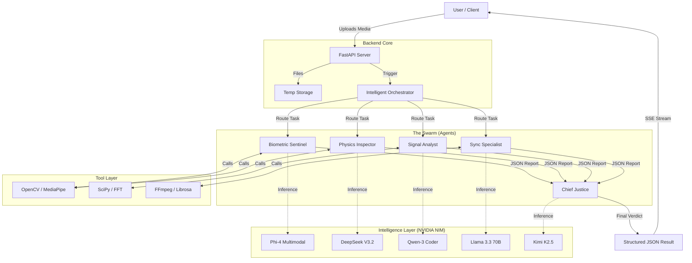

<div align="center">

# 🔍 Veritas Swarm

### Multi-Agent AI System for Deepfake Detection

[](https://www.python.org/downloads/)
[](https://reactjs.org/)
[](https://fastapi.tiangolo.com/)

**Veritas** is an advanced forensic system that uses a "swarm" of specialized AI agents to detect synthetic media. Unlike single-model detectors, Veritas employs a team of experts—biometricians, physicists, and signal analysts—who collaborate to deliver comprehensive, explainable verdicts.

[Features](#-features) • [Architecture](#-architecture) • [Quick Start](#-quick-start) • [Documentation](#-documentation)

</div>

---

## 🎯 What Makes Veritas Different?

| Traditional AI Detectors | Veritas Swarm |
|-------------------------|---------------|
| Single model, black-box prediction | 5 specialized LLMs working in concert |
| "Fake: 85%" with no explanation | Detailed forensic report with evidence |
| Image-only analysis | Multi-modal: image, video, audio |
| One-size-fits-all approach | Adaptive tool selection by media type |
| Probability score | Structured verdict + layman's brief |

---

## ✨ Features

### 🤖 Multi-Agent Architecture

**4 Specialist Agents + 1 Master Judge**

- **Biometric Sentinel** (`microsoft/phi-4`) - Analyzes facial landmarks, blink patterns, and face blending artifacts
- **Physics Inspector** (`deepseek-ai/deepseek-v3.2`) - Detects lighting inconsistencies and 3D pose anomalies
- **Signal Analyst** (`qwen/qwen2.5-coder-32b`) - Identifies GAN fingerprints and frequency domain artifacts
- **Sync Specialist** (`meta/llama-3.3-70b`) - Examines audio-visual synchronization and lip-sync accuracy
- **Chief Justice** (`moonshotai/kimi-k2.5`) - Synthesizes all findings into a final, weighted verdict

### 🛠️ 10 Specialized Analysis Tools

Built with OpenCV, NumPy, SciPy, and FFmpeg:

**Biometric Tools** (3)
- Facial landmark tracking
- Blink anomaly detection
- Face blending seam detection

**Physics Tools** (2)
- 3D head pose analysis
- Lighting inconsistency detection

**Signal Tools** (2)
- Frequency domain analysis (FFT)
- GAN fingerprint detection

**Audio-Sync Tools** (3)
- Audio track extraction
- Lip-sync analysis
- Audio-visual offset calculation

### 🎨 Modern Web Interface

- **Real-time SSE streaming** - Watch agents work in real-time
- **Drag-and-drop upload** - Support for images and videos
- **Interactive landing page** - Feature highlights, use cases, and FAQ
- **Responsive design** - Built with React 18, Tailwind CSS, and Framer Motion
- **Dark theme** - Sleek, professional UI with glow effects

### 🧠 Intelligent Orchestration

The system automatically adapts analysis based on file type:

- **Images**: 3 agents (Biometric + Physics + Signal) → ~40% faster
- **Videos**: All 5 agents (including Audio-Sync) → Full analysis

### � Structured Output

Every analysis produces:

```
VERDICT SCORE: 0-100 (0 = authentic, 100 = fake)
CONFIDENCE: HIGH | MEDIUM | LOW

KEY FINDINGS:
• Blink rate: 3.2/min (normal: 15-20) - SUSPICIOUS
• Lighting mismatch: 67.5 units difference - ANOMALOUS
• GAN fingerprint detected: 0.28 ratio - SYNTHETIC

LAYMAN'S BRIEF:
This video shows signs of manipulation. The person blinks far less 
frequently than natural (3 times per minute vs. 15-20 expected), 
suggesting AI-generated facial animation. Additionally, lighting on 
the face doesn't match the environment, and we detected digital 
artifacts typical of GAN-based face synthesis.
```

---

## 🏗️ Architecture



### Tech Stack

**Backend**
- **Framework**: CrewAI (multi-agent orchestration), FastAPI (API server)
- **AI Models**: NVIDIA NIM (5 specialized LLMs via LiteLLM)
- **Computer Vision**: OpenCV, MediaPipe, DeepFace
- **Signal Processing**: NumPy, SciPy, FFmpeg
- **Audio Analysis**: Librosa, PyTorch

**Frontend**
- **Framework**: React 18 with Vite
- **Styling**: Tailwind CSS
- **Animation**: Framer Motion
- **Routing**: React Router v6
- **Icons**: Lucide React

---

## 🚀 Quick Start

### Prerequisites

- Python 3.10 or higher
- Node.js 18+ (for frontend)
- NVIDIA API Key ([Get one here](https://build.nvidia.com/))
- FFmpeg (optional, for audio analysis)

### Backend Setup

1. **Clone the repository**
   ```bash
   git clone https://github.com/theomatrix/veritas-swarm.git
   cd veritas-swarm/backend-adk-agents
   ```

2. **Create virtual environment**
   ```bash
   python -m venv .venv
   
   # Windows
   .venv\Scripts\activate
   
   # macOS/Linux
   source .venv/bin/activate
   ```

3. **Install dependencies**
   ```bash
   pip install -r requirements.txt
   ```

4. **Configure environment**
   ```bash
   # Copy example env file
   copy .env.example .env  # Windows
   cp .env.example .env    # macOS/Linux
   
   # Edit .env and add your NVIDIA API key
   NVIDIA_API_KEY=nvapi-your-key-here
   CREWAI_TRACING_ENABLED=false
   ```

5. **Run the server**
   ```bash
   python -m uvicorn server:app --reload
   ```

   Server will start at `http://localhost:8000`

### Frontend Setup

1. **Navigate to frontend directory**
   ```bash
   cd ../veritas-agent
   ```

2. **Install dependencies**
   ```bash
   npm install
   ```

3. **Start development server**
   ```bash
   npm run dev
   ```

   Frontend will start at `http://localhost:5173`

### 🎮 Demo Mode (No API Key Required)

Veritas includes a mock mode for testing without API costs:

1. Don't set `NVIDIA_API_KEY` in `.env`
2. Start the backend server
3. Upload any image/video - you'll get realistic pre-written analysis

Perfect for frontend development and demonstrations!

---

## 📖 Documentation

Comprehensive documentation is available in the `docs/` directory:

- **[Features & Capabilities](docs/FEATURES.md)** - Detailed feature breakdown
- **[System Architecture](docs/ARCHITECTURE.md)** - Technical wireframes and data flow
- **[Tools Guide](docs/TOOLS_GUIDE.md)** - Deep dive into the 10 forensic tools
- **[Detection Methods](docs/DETECTION_METHODS.md)** - The science behind detection
- **[Agent Instructions](docs/AGENT_INSTRUCTIONS.md)** - Agent prompts and logic
- **[Tech Stack](TECH_STACK.md)** - Technology choices and rationale

---

## 🧪 Testing

### Backend Tests

```bash
cd backend-adk-agents
pytest tests/
```

Test files:
- `tests/test_api.py` - API endpoint tests
- `tests/test_config.py` - Configuration tests
- `tests/test_callbacks_live.py` - SSE streaming tests

### Frontend Tests

```bash
cd veritas-agent
npm run lint
npm run check  # TypeScript type checking
```

---

## 📊 Performance

**Speed**:
- Images: ~10-15 seconds
- Videos (10s): ~20-30 seconds
- Videos (1min): ~60-90 seconds

**Estimated Accuracy**:
- Face-swap deepfakes: ~85-90%
- GAN-generated images: ~80-85%
- Lip-sync deepfakes: ~75-80%
- High-quality deepfakes: ~60-70%

*Note: Accuracy depends on manipulation quality and media resolution*

---

## 🎯 Use Cases

- **Journalism** - Verify authenticity of submitted media
- **Social Media Moderation** - Flag suspicious content
- **Legal Evidence** - Pre-screen media for manipulation
- **Personal Verification** - Check if media is trustworthy
- **Research** - Study deepfake detection techniques
- **Education** - Teach media literacy

---

## 🔮 Roadmap

- [ ] GPU acceleration for faster processing
- [ ] Advanced lip-sync analysis (SyncNet integration)
- [ ] Deepfake generation model fingerprinting
- [ ] Batch processing support
- [ ] Confidence calibration
- [ ] User feedback loop for model improvement
- [ ] API rate limiting and authentication
- [ ] Docker containerization

---

## 🤝 Contributing

Contributions are welcome! Please feel free to submit a Pull Request.

1. Fork the repository
2. Create your feature branch (`git checkout -b feature/AmazingFeature`)
3. Commit your changes (`git commit -m 'Add some AmazingFeature'`)
4. Push to the branch (`git push origin feature/AmazingFeature`)
5. Open a Pull Request

---

<div align="center">

**Built with ❤️ by the Team Vigilante **

⭐ Star us on GitHub if you find this project useful!

</div>
