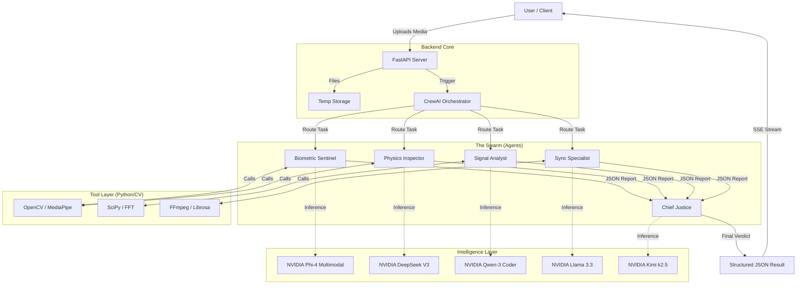

# Veritas Swarm - System Architecture

## Technical Architecture Wireframe

The Veritas Swarm uses a modular, event-driven architecture designed for real-time analysis and scalability.



## Data Flow Description

1.  **Ingestion:**
    *   User uploads a file (Image/Video) via the React Frontend.
    *   FastAPI receives the stream and saves it to an ephemeral temporary directory.

2.  **Orchestration:**
    *   The `VeritasCrew` initializes.
    *   **Dynamic Routing:** Based on file type (image vs. video), the Orchestrator enables/disables specific agents (e.g., Sync Specialist is disabled for images).

3.  **Analysis Phase (Parallel/Sequential):**
    *   Agents receive their specific "Objective" and "Backstory".
    *   **Tool Execution:** Agents call their respective Python tools. The tools perform the heavy lifting (pixel-level analysis, FFT, etc.) and return raw data (JSON metrics, not images) to the Agent.
    *   **Reasoning:** The LLM interprets the raw data.
        *   *Example:* Tool returns `{"blink_rate": 2}`. LLM interprets: "2 blinks/min is pathological; indicative of deepfake."

4.  **Synthesis Phase:**
    *   The **Chief Justice** agent receives the outputs from all specialist agents.
    *   It weighs conflicting evidence (e.g., "Physics says real, but Signal says fake").
    *   It calculates a weighted probability score.

5.  **Streaming Response:**
    *   Server-Sent Events (SSE) push updates to the client in real-time as each agent finishes, providing a responsive UX.

## Directory Structure

```
veritas-multiagent/
├── backend-adk-agents/
│   ├── tools/               # The "Eyes" (CV & Signal processing code)
│   │   ├── biometric_tools.py
│   │   ├── physics_tools.py
│   │   └── ...
│   ├── agents.py            # The "Brains" (Prompts & Persona definitions)
│   ├── tasks.py             # The "Instructions" (Specific goals)
│   ├── crew.py              # The "Manager" (Orchestration logic)
│   ├── server.py            # The "Interface" (API & Streaming)
│   └── config.py            # LLM Configuration
└── docs/                    # Documentation
    ├── TOOLS_GUIDE.md
    ├── FEATURES.md
    └── ...
```

## Tech Stack

*   **Orchestration:** CrewAI
*   **API:** FastAPI, Uvicorn, SSE-Starlette
*   **AI Models:** NVIDIA NIM (Phi-4, DeepSeek, Llama 3, Qwen, Kimi)
*   **Computer Vision:** OpenCV, MediaPipe
*   **Audio/Signal:** NumPy, SciPy, FFmpeg
